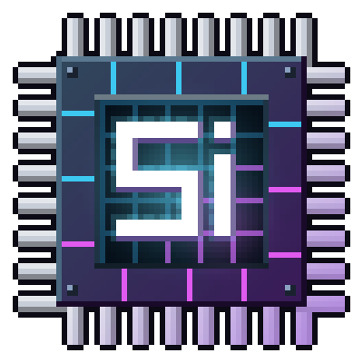

# Silicon Age: From Wafer to ExoTech

  

**[Русский](#русский) | [English](#english)**

---

## Русский

Технический мод для Minecraft 1.7.10: путь от кремниевой пластины до экзотехнологий. Вы добываете руды, строите производство полупроводников и энергосеть, а в конце собираете энергетическую броню, клинки, буры и защитные поля.

> ⚠️ **Альфа-версия.** Возможны ошибки и изменения, ломающие миры. Делайте резервные копии миров.

### Возможности
- **Производство полупроводников:** цепочка от кварца и руд до кремниевых пластин, кристаллов, чипов и контроллеров. 29 машин уровней LV–EV, улучшения машин, брак и побочные продукты.
- **Руды и переработка:** 16 руд, дробление, промывка, центрифуга, химия и жидкости.
- **Энергия LV → XV:** семь уровней напряжения — LV, MV, HV, EV, **IV**, **QV (Квант)** и **XV (Экзо)** до 32 768 EU/t.
  - Кабели каждого уровня с потерями; кабель под слишком высоким напряжением сгорает с дымом, как в IC2.
  - Трансформаторы, энергонакопители до 2 млрд EU, **зарядные плиты**, модуль трансформатора и **универсальный модуль трансформатора** (любое напряжение).
- **Генераторы (20+):** твердотопливный, водяное колесо, ветрогенератор, РИТЭГ, термоэлектрический, геотермальный, водородный топливный элемент, внутреннего сгорания (дизель, нефть, биотопливо…), солнечные панели от кремниевых до Нано / Квант / Экзо, паровая и газовая турбины, плазменный генератор, термоядерный реактор, **токамак** и **экзо-сингулярный реактор**. Модули «Форсаж» и «Экономайзер».
- **Переносные аккумуляторы LV–XV:** от кремниевой батарейки (40 000 EU) до экзо-ядра (4 млрд EU); режимы Shift + ПКМ — заряжать броню, предмет в руке или всё с собой. **Слот аккумулятора** под шкалой энергии у всех машин, карьеров и генератора поля (питает их) и у генераторов (заряжается выработкой); автоматика кладёт и забирает аккумуляторы.
- **Кнопка питания и красный камень** у машин, генераторов, накопителей, карьеров и генератора поля: выключенный блок не берёт энергию и не работает.
- **Кремниевый карьер LV–EV и Экзо-буровая установка (XV):**
  - Своё меню из 7 вкладок, область с картой и лазерной рамкой в мире, сменные головки бура.
  - **23 модуля**: скорость, удача, шёлковое касание, дробление, промывка, центрифуга, насос, магнит, радиус, жила, двойной бур, утилизатор, защита от жидкостей, мягкий режим, ремонт головки, энергоэкономия, **расширенный бак**, **насосная жила** и другие. Слоты модулей растут с уровнем.
  - **Насос с баком из отсеков** (до 4 жидкостей) и вкладка **«Баки»**: сторона выдачи, очистка за энергию, закрепление жидкости, автовыдача, фильтр жидкостей, действие при полном баке. Насос забирает водоём целиком, «бесконечная» вода не восстанавливается.
  - Экзо-установка лазером поднимает руду из недр; линзы руды, резонатор, стабилизатор и глубинный сканер (руды других модов).
- **Ключи трёх уровней:** поворот машин, демонтаж с сохранением заряда и содержимого, копирование настроек.
- **Логистика:** связки кабелей, труб и пневмотрубок в одном блоке (как в Ender IO), фильтры предметов, переносные баки.
- **Энергоброня Нано / Квант / Экзо:** больше 20 функций (полёт, ночное зрение, сканеры руд и существ, солнечная плёнка, щит, восстановление, импульс уничтожения и другие), чипы, режимы питания, нагрев, бонусы полного комплекта.
  - У каждого комплекта свой стиль и объёмные детали на модели.
  - Огни брони светятся в темноте и показывают заряд. Цвет огней выбирается, есть аура полного комплекта.
  - Все функции включаются и назначаются на клавиши в меню **K**.
- **Энергоклинки** трёх уровней: режущая кромка, энергоблок, широкий взмах, энергетическая волна, «Добыча» до V.
- **Электробуры** трёх уровней: площадь 3x3 и 5x5, туннель, жила, шёлковое касание, удача до V, автоплавка, лазер, связь с сундуком. Питаются от надетой брони.
- **Генератор поля:** кластер до 8 узлов, 5 форм поля.
  - Защита от мобов, снарядов и взрывов.
  - Запрет спавна, приватная зона со списком доступа, лечение союзников.
  - **Беспроводная зарядка** предметов мода, IC2 и RF: модуль усилителя, приоритет, резерв буфера, искры.
  - Модули энергонакопителя и трансформатора, управление редстоуном, схема поля в экране генератора.
  - Вкладка **«Зона»**: радиус, высота, смещение, центр и форма поля с предпросмотром; граница, бегущий пунктир, анимация, яркость, лучи между узлами, гудение, три цвета RGB и 24 готовых цвета.
  - **Защита от дождя:** внутри поля нет дождя и снега, вода не замерзает, молнии гасятся.
  - Режимы беспроводной зарядки: всё сразу, сначала броня / рука, самые разряженные или почти полные, порог «заряжать ниже N%».
- **Меню-голоэкраны:** у каждой машины и генератора свой экран с анимированной сценой процесса (дробилка, CVD, степпер, турбины, реакторы, солнечные панели…), шкала энергии с процентами, полноразмерные баки с текстурой жидкости; тот же стиль у карьера, генератора поля и страниц NEI.
- **Энергонакопители:** компаратор, выход поворачивается ключом, слот разрядки, модули (трансформатор, объём, форсаж), до 4 слотов зарядки на старших уровнях.
- **Жидкости:** вёдра для всех 22 жидкостей мода, заливка и слив ведром или капсулой по машине, модуль расширенного бака и очистка баков за энергию.
- **Справочник инженера** в игре: выдаётся при первом крафте любого предмета мода.

### Управление
| Клавиша | Действие |
|---|---|
| **K** | Меню брони, клинка, бура и режима питания: функции и их клавиши |
| **R** | Рывок (Экзо-поножи) |
| **Гаечный ключ** | ПКМ — повернуть механизм, Shift + ПКМ в воздух — сменить режим (у электро- и квантового ключа) |
| **Shift / Ctrl** | Подробности и управление в подсказках предметов |

### Требования и установка
1. Minecraft **1.7.10**, Forge **10.13.4.1614** (или новее для 1.7.10), Java 8.
2. Скачайте `SiliconAgeAlpha-0.1.4.jar` на странице [Releases](../../releases) и положите в папку `.minecraft/mods`.

### Моды, которые помогут (необязательны)
| Мод | Что даёт вместе с Silicon Age |
|---|---|
| **IndustrialCraft 2 Experimental** (2.2.828+) | Общая энергосеть с машинами и кабелями IC2, зарядка брони, клинков и буров в зарядниках IC2, зарядные плиты и генератор поля заряжают и предметы IC2 |
| **Not Enough Items** + **CodeChickenCore** | Страницы рецептов всех машин и генераторов (с жидкостями, шансами и EU/t), переход к рецептам из экрана машины |
| **WAILA** (1.5.10) | Подсказка при наведении: заряд, выработка, прогресс машин, жидкости в баках |
| **BuildCraft**, **Thermal Expansion** (CoFH), **Ender IO** | Их гаечные ключи поворачивают машины и работают на трубах и связках Silicon Age; генератор поля заряжает их RF-предметы |

### Сборка из исходников
1. Нужны JDK 8 и Gradle 2.14 (ForgeGradle 1.2).
2. Положите в папку `libs/` jar-файлы для компиляции (в репозиторий они не входят): `industrialcraft-2-2.2.828-experimental.jar`, `NotEnoughItems-1.7.10-1.0.5.120-universal.jar`, `CodeChickenCore-1.7.10-1.0.7.48-universal.jar`, `CodeChickenLib-1.7.10-1.1.3.141-universal.jar`, `Waila-1.5.10_1.7.10.jar`.
3. Выполните `gradle build`. Готовый jar появится в `build/libs/`.

### Лицензия
© 2026 Aleksandr. Все права защищены. Код открыт для просмотра; копирование, изменение и распространение (в том числе в сборках) — только с разрешения автора.

---

## English

A tech mod for Minecraft 1.7.10: the way from a silicon wafer to ExoTech. You mine ores, build semiconductor production and an energy network, and end up with energy suits, blades, drills and protective fields.

> ⚠️ **Alpha.** Expect bugs and world-breaking changes. Back up your worlds.

### Features
- **Semiconductor fabrication:** a chain from quartz and ores to silicon wafers, crystals, chips and controllers. 29 machines from LV to EV, machine upgrades, defects and by-products.
- **Ores and processing:** 16 ores, crushing, washing, centrifuge, chemistry and fluids.
- **Energy LV → XV:** seven voltage tiers - LV, MV, HV, EV, **IV**, **QV (Quantum)** and **XV (Exo)**, up to 32,768 EU/t.
  - Cables for every tier with loss; a cable under too high a voltage burns out with smoke, as in IC2.
  - Transformers, energy storages up to 2B EU, **charge pads**, the transformer upgrade and the **universal transformer upgrade** (any voltage).
- **Generators (20+):** solid fuel, water wheel, wind turbine, RTG, thermoelectric, geothermal, hydrogen fuel cell, combustion (diesel, crude oil, biofuel...), solar panels from silicon up to Nano / Quantum / Exo, steam and gas turbines, plasma generator, fusion reactor, **tokamak** and the **Exo singularity reactor**. Overdrive and Economizer upgrades.
- **Portable batteries LV-XV:** from the silicon cell (40,000 EU) to the Exo core (4B EU); sneak + right-click modes charge your armour, the held item or everything you carry. **A battery slot** under the energy gauge of every machine, quarry and the field generator (it powers them) and of the generators (their output charges it); automation puts batteries in and takes them out.
- **A power switch and redstone control** on machines, generators, storages, quarries and the field generator: a switched-off block takes no energy and does nothing.
- **Silicon Quarry LV-EV and the Exo Drilling Rig (XV):**
  - A seven-tab screen, an area with a map and a laser frame in the world, swappable drill heads.
  - **23 modules**: speed, fortune, silk touch, crushing, washing, centrifuge, pump, magnet, radius, vein miner, twin drill, trash disposal, fluid guard, gentle mode, head repair, energy saver, **tank extension**, **fluid vein** and more. Module slots grow with the tier.
  - **A pump with a compartment tank** (up to 4 fluids) and a **Tanks** tab: output side, clearing for energy, pinning a fluid, auto output, a fluid filter, what to do when full. The pump takes a whole body of water, so "infinite" water doesn't refill.
  - The rig's laser brings ore up from the deep; ore lenses, resonator, stabilizer and a deep scanner (other mods' ores).
- **Wrenches in three tiers:** turning machines, dismantling with charge and contents kept, copying settings.
- **Logistics:** cable, pipe and pneumatic tube bundles in one block (Ender IO style), item filters, portable tanks.
- **Nano / Quantum / Exo energy suits:** 20+ functions (flight, night vision, ore and life scanners, solar film, shield, regeneration, annihilation pulse and more), chips, power modes, heat, full-set bonuses.
  - Each suit has its own style and 3D parts on the worn model.
  - The armour lights glow in the dark and show the charge. The light colour can be picked; a full set has an aura.
  - Every function is switched and key-bound in the **K** screen.
- **Energy blades** in three tiers: cutting edge, energy block, wide sweep, energy wave, Looting up to V.
- **Electric drills** in three tiers: 3x3 and 5x5 areas, tunnel, vein, silk touch, fortune up to V, autosmelt, laser, chest link. Powered by the worn suit.
- **Field generator:** a cluster of up to 8 nodes, 5 field shapes.
  - Protection from mobs, projectiles and explosions.
  - No spawning, a private zone with an access list, healing of allies.
  - **Wireless charging** of the mod's, IC2 and RF items: a charge booster upgrade, priority, a buffer reserve, sparks.
  - Energy storage and transformer upgrades, redstone control, a map of the field on its screen.
  - A **Zone** tab: the field's radius, height, offset, centre and shape with a preview; outline, running dashes, animation, brightness, node beams, hum, three RGB colours and 24 ready colours.
  - **Rain shield:** no rain or snow inside the field, no water freezing, lightning put out.
  - Wireless charging modes: all at once, armour / held item first, emptiest or nearly full first, a "charge below N%" threshold.
- **Holo-screen menus:** every machine and generator has its own screen with an animated scene of its process (crusher, CVD, stepper, turbines, reactors, solar panels...), an energy gauge with the percentage and full-size tank gauges in the fluid's texture; the quarry, the field generator and the NEI pages share the style.
- **Energy storages:** comparator output, the output face turned with a wrench, a discharge slot, upgrades (transformer, capacity, overdrive), up to 4 charge slots on the higher tiers.
- **Fluids:** buckets for all 22 of the mod's fluids, filling and draining machines with a bucket or a cell, a tank extension upgrade and clearing tanks for energy.
- **Engineer's handbook** in game: given on the first craft of any item of the mod.

### Controls
| Key | Action |
|---|---|
| **K** | Suit, blade, drill and power mode screen: functions and their keys |
| **R** | Dash (Exo leggings) |
| **Wrench** | Right-click turns a machine, sneak + right-click in the air switches the mode (electric and quantum wrench) |
| **Shift / Ctrl** | Details and controls in item tooltips |

### Requirements and installation
1. Minecraft **1.7.10**, Forge **10.13.4.1614** (or newer for 1.7.10), Java 8.
2. Download `SiliconAgeAlpha-0.1.4.jar` from [Releases](../../releases) and put it into `.minecraft/mods`.

### Mods that help (optional)
| Mod | What it adds with Silicon Age |
|---|---|
| **IndustrialCraft 2 Experimental** (2.2.828+) | One energy network with IC2 machines and cables, suits, blades and drills charge in IC2 chargers, charge pads and the field generator charge IC2 items too |
| **Not Enough Items** + **CodeChickenCore** | Recipe pages for every machine and generator (fluids, chances, EU/t), recipes straight from a machine's screen |
| **WAILA** (1.5.10) | Look-at info: charge, output, machine progress, tank contents |
| **BuildCraft**, **Thermal Expansion** (CoFH), **Ender IO** | Their wrenches turn machines and work on Silicon Age pipes and bundles; the field generator charges their RF items |

### Building from source
1. JDK 8 and Gradle 2.14 (ForgeGradle 1.2).
2. Put the compile-only jars into `libs/` (they are not part of this repository): `industrialcraft-2-2.2.828-experimental.jar`, `NotEnoughItems-1.7.10-1.0.5.120-universal.jar`, `CodeChickenCore-1.7.10-1.0.7.48-universal.jar`, `CodeChickenLib-1.7.10-1.1.3.141-universal.jar`, `Waila-1.5.10_1.7.10.jar`.
3. Run `gradle build`. The jar is written to `build/libs/`.

### License
© 2026 Aleksandr. All rights reserved. The source is open to read; copying, modifying and redistributing it (modpacks included) only with the author's permission.
